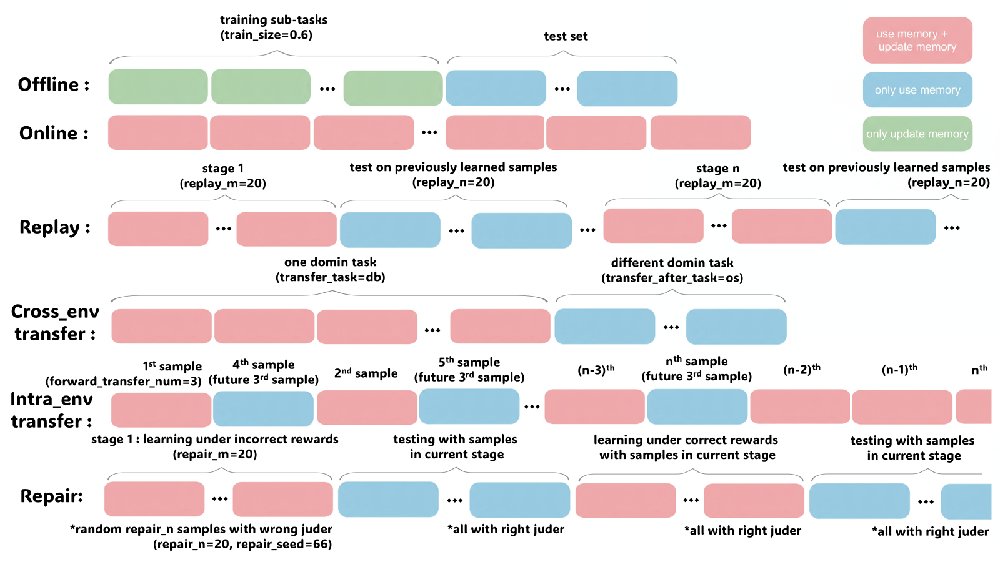

<div align="center">
  

  <br/>
  <br/>

  <a href="https://github.com/s010m00n/AgentMemoryBench/stargazers">
    
  </a>
  <a href="https://github.com/s010m00n/AgentMemoryBench/network/members">
    
  </a>
  <a href="https://github.com/s010m00n/AgentMemoryBench/issues">
    
  </a>
  <a href="https://github.com/s010m00n/AgentMemoryBench/blob/main/LICENSE">
    
  </a>

  <br/>
  <br/>

  <p align="center">
    <strong>A Unified Benchmark for Continual Agent Memory</strong>
    <br />
    <br />
    A comprehensive benchmark for evaluating memory mechanisms in LLM-based agents across continual learning scenarios, supporting both <strong>system memory</strong> (task workflows) and <strong>personal memory</strong> (user preferences).
    <br />
    <br />
    <a href="#overview">Overview</a> •
    <a href="#evaluation-modes">Evaluation Modes</a> •
    <a href="#quick-start">Quick Start</a> •
    <a href="#creating-custom-memory-mechanisms">Custom Memory</a> •
    <a href="#implemented-memory-mechanisms">Methods</a>
  </p>
</div>

---

<h2 id="overview">🎯 Overview</h2>

AgentMemoryBench provides a unified framework to evaluate how LLM agents learn and retain two types of memory:
- **System Memory**: Task workflows and execution patterns
- **Personal Memory**: User preferences and dialogue context

The benchmark spans **6 interactive tasks** across 4 grounding types:
- **Code-grounded**: Database (SQL), Operating System (Shell), Knowledge Graph (SPARQL)
- **Embodied**: ALFWorld (household tasks)
- **Web-grounded**: WebShop (e-commerce)
- **Dialogue-grounded**: LoCoMo (long-term conversations)

<h2 id="evaluation-modes">📊 Evaluation Modes</h2>

AgentMemoryBench supports **5 complementary evaluation modes** to provide multi-dimensional assessment of memory systems:



### 1. **Offline Mode**
Traditional train-test split evaluation. The agent learns from training samples (memory formation & evolution) and is tested on held-out samples (retrieval only).

**Metrics**: Average Success Rate (ASR), Average Steps (AS), F1-score, BLEU, LLM-as-Judge

### 2. **Online Mode**
Streaming evaluation where agents process samples sequentially with real-time memory updates. Performance is recorded after each sample to capture learning dynamics.

**Metrics**: Cumulative Success Rate (CSR), Learning Gain (LG), Stability Loss (SL)

### 3. **Replay Mode**
Periodic testing to measure knowledge retention and resistance to forgetting. After learning each stage, agents are tested on previously learned samples.

**Metrics**: Forgetting Rate (FR), Average Success Rate (ASR)

### 4. **Transfer Mode**
- **Cross-environment**: Tests knowledge generalization across different domains (e.g., DB→OS)
- **Within-environment**: Measures forward transfer—how learning current samples helps future ones

**Metrics**: Transfer Gain (TG), Forward Transfer Gain (FTG)

### 5. **Repair Mode**
Tests robustness and self-correction under erroneous feedback. Agents learn under incorrect rewards, then repair memory with correct feedback.

**Metrics**: Error Robustness (ER), Repair Gain (RG), Net Recovery (NR)

## 🏗️ Project Structure

```
AgentMemoryBench/
├── configs/                    # Configuration files
│   ├── assignment/            # Experiment configurations
│   │   └── default.yaml       # Main experiment config
│   ├── tasks/                 # Task-specific configs (6 tasks)
│   │   ├── dbbench.yaml       # Database (SQL)
│   │   ├── os.yaml            # Operating System (Shell)
│   │   ├── kg.yaml            # Knowledge Graph (SPARQL)
│   │   ├── alfworld.yaml      # Embodied AI
│   │   ├── webshop.yaml       # E-commerce
│   │   └── locomo-*.yaml      # Long conversations (0-9)
│   └── llmapi/                # LLM API configurations
│       ├── api.yaml           # API endpoint & key for agent LLM
│       ├── agent.yaml         # Agent model name
│       ├── evaluate_api.yaml  # API for LoCoMo LLM-as-Judge
│       └── evaluate_agent.yaml# Model for evaluation
│
├── data/                       # Task datasets
│   ├── dbbench/               # Database operations (SQL)
│   ├── os_interaction/        # OS commands (Shell)
│   ├── knowledgegraph/        # KG queries (SPARQL)
│   ├── alfworld/              # Embodied tasks
│   ├── webshop/               # E-commerce tasks
│   └── locomo/                # Long dialogues (10 conversations)
│
├── memory/                     # Memory mechanism implementations
│   ├── base.py                # Base class for all memory mechanisms
│   ├── registry.py            # Memory registry system
│   ├── zero_shot/             # Baseline (no memory)
│   ├── streamICL/             # RAG-based retrieval (topk=4)
│   ├── AWM/                   # System memory via workflows
│   ├── mem0/                  # Personal memory via preferences
│   ├── everos_agent/          # Hosted agent memory via EverOS
│   ├── everos_personal/       # Hosted personal memory via EverOS
│   └── MEMs/                  # Multi-memory coordination (proposed)
│
├── execution/                  # Execution engines
│   ├── base.py                # Base execution engine
│   └── single_agent/          # Single-agent executor
│
├── src/                        # Core implementation
│   ├── runner/                # Main entry point
│   │   ├── main.py            # Experiment runner
│   │   ├── builders.py        # Component builders
│   │   ├── config.py          # Configuration parser
│   │   └── schedule_utils.py  # Scheduling utilities
│   ├── client/                # Client-side scheduling
│   │   ├── backend.py         # Backend interface
│   │   └── scheduler.py       # Task scheduler
│   ├── server/                # Backend task servers (Docker)
│   │   └── tasks/             # Task implementations
│   └── utils/                 # Analysis utilities
│       ├── message_schema.py  # Message format compatibility layer
│       └── analyze_results_*.py # Result analysis scripts
│
├── extra/                      # Docker orchestration
│   ├── docker-compose.yml     # Service definitions
│   └── *.Dockerfile           # Task-specific containers
│
├── outputs/                    # Experiment results
│   └── [timestamp]/           # Grouped by experiment time
│       └── [task_name]/       # Grouped by task
│           └── [index].json   # Individual sample results
│
├── requirements.txt            # Python dependencies
└── README.md                   # This file
```

<h2 id="quick-start">🚀 Quick Start</h2>

### 1. Prerequisites

#### Python Environment
```bash
# Create conda environment with Python 3.9
conda create -n aMB python=3.9

# Activate environment
conda activate aMB

# Navigate to project directory
cd /path/to/AgentMemoryBench

# Install dependencies
pip install -r requirements.txt
```

#### Docker Installation
Docker is required to run backend task servers. Install Docker Desktop:
- **Windows/Mac**: [Docker Desktop](https://www.docker.com/products/docker-desktop)
- **Linux**: Follow [official guide](https://docs.docker.com/engine/install/)

### 2. Data & Model Setup

#### Knowledge Graph (Freebase) Database

The Knowledge Graph task requires the Freebase database:

1. **Download database** (~50 GB):
   - Download link: [OneDrive](https://buckeyemailosu-my.sharepoint.com/:u:/g/personal/su_809_osu_edu/Ed0SY7sAS_ZGqNTovDYhVCcBxEmZfhL3B-chAiuoZCrpVg?e=vpHUei)
   - **Recommended**: Use a download manager (e.g., Free Download Manager) instead of browser

2. **Extract** the downloaded `virtuoso_db.zip`

3. **Configure path** in `extra/docker-compose.yml` (line 114):
   ```yaml
   freebase:
     build:
       context: ..
       dockerfile: extra/freebase.Dockerfile
     volumes:
       - "/absolute/path/to/virtuoso_db:/database"  # Use absolute path
     init: true
   ```

   **Important**:
   - Use **absolute paths**
   - Windows: Use forward slashes `/` (e.g., `C:/Users/...`)
   - Example: `B:/desktop/AgentMemoryBench/virtuoso_db:/database`

Make sure `nltk` is installed via `requirements.txt`.

#### Embedding Model (for streamICL and AWM)

Download the embedding model for fair comparison:

```bash
# Download bge-base-en-v1.5 from HuggingFace
# https://huggingface.co/BAAI/bge-base-en-v1.5

# Configure paths in YAML files:
# - memory/streamICL/streamICL.yaml
# - memory/AWM/AWM.yaml
```

#### Mem0 API Key

To use the Mem0 method:

1. Register for API key at [mem0.ai](https://app.mem0.ai/)
2. Configure in `memory/mem0/mem0.yaml`:
   ```yaml
   api_key: "your_mem0_api_key_here"
   wait_time: 60.0  # Recommended: 60s for system tasks, 150s for personal, 100s for mixed
   ```

#### EverOS API Key

To use the EverOS agent-memory method:

1. Register for an API key at [everos.evermind.ai](https://everos.evermind.ai)
2. Configure in `memory/everos_agent/everos_agent.yaml`:
   ```yaml
   api_key: "your_everos_api_key_here"
   user_id: "exp_001"
   search_method: "hybrid"
   memory_types:
     - "agent_memory"
   flush_after_add: true
   ```

To use the EverOS personal-memory method:

1. Register for an API key at [everos.evermind.ai](https://everos.evermind.ai)
2. Configure in `memory/everos_personal/everos_personal.yaml`:
   ```yaml
   api_key: "your_everos_api_key_here"
   user_id: "exp_001"
   search_method: "hybrid"
   memory_types:
     - "episodic_memory"
     - "profile"
   flush_after_add: true
   ```

### 3. Start Backend Services

```bash
# Navigate to Docker directory
cd extra

# Build required containers
docker pull mysql:8
docker-compose build local-os-default
docker-compose build local-os-packages
docker-compose build local-os-ubuntu
docker-compose build freebase

# Start all services
docker-compose up
```

**Note**: Keep this terminal running. Services run on `http://localhost:5038`

### 4. Configure LLM API

**Recommended**: Use [SiliconFlow API](https://siliconflow.cn/) to avoid model name mismatches.

#### Agent LLM Configuration

Edit `configs/llmapi/api.yaml`:

```yaml
base_url: "https://api.siliconflow.cn/v1"
headers:
  Content-Type: application/json
  Authorization: "Bearer YOUR_API_KEY"
```

Edit `configs/llmapi/agent.yaml`:

```yaml
model: "Qwen/Qwen2.5-14B-Instruct"  # Or your preferred model
```

#### Evaluation LLM (for LoCoMo LLM-as-Judge)

Edit `configs/llmapi/evaluate_api.yaml`:

```yaml
base_url: "https://api.siliconflow.cn/v1"
headers:
  Content-Type: application/json
  Authorization: "Bearer YOUR_API_KEY"
```

Edit `configs/llmapi/evaluate_agent.yaml`:

```yaml
model: "Qwen/Qwen2.5-14B-Instruct"  # Or evaluation model
```

### 5. Configure Experiments

Edit `configs/assignment/default.yaml`:


### 6. Run Experiments

```bash
# Run with default configuration
python -m src.runner.main

# Or specify custom config
python -m src.runner.main --config configs/assignment/my_experiment.yaml
```

<h2 id="creating-custom-memory-mechanisms">🛠️ Creating Custom Memory Mechanisms</h2>

### Step 1: Implement Memory Class

Create a new directory under `memory/` (e.g., `memory/my_memory/`):

```python
# memory/my_memory/my_memory.py
from __future__ import annotations
from typing import List, Dict, Any
import yaml
from ..base import MemoryMechanism

class MyMemory(MemoryMechanism):
    """Your custom memory mechanism"""

    def __init__(self, config: Dict[str, Any]):
        self.config = config
        # Initialize your memory storage

    def use_memory(
        self,
        task: str,
        messages: List[Dict[str, Any]]
    ) -> List[Dict[str, Any]]:
        """
        Enhance messages with memory before LLM call.

        Args:
            task: Task name (e.g., "dbbench-std", "os-std")
            messages: Original message list

        Returns:
            Enhanced messages with retrieved memory
        """
        # Retrieve relevant experience from memory
        # Inject experience into messages
        return messages  # Return enhanced messages

    def update_memory(
        self,
        task: str,
        history: List[Dict[str, Any]],
        result: Dict[str, Any]
    ) -> None:
        """
        Update memory after sample execution.

        Args:
            task: Task name
            history: Full dialogue history
            result: Execution result (reward, status, etc.)
        """
        # Update your memory storage based on history and result
        pass

def load_my_memory_from_yaml(config_path: str) -> MyMemory:
    """Load memory from YAML config"""
    with open(config_path, "r", encoding="utf-8") as f:
        config = yaml.safe_load(f) or {}
    return MyMemory(config)
```

Create configuration file `memory/my_memory/my_memory.yaml`:

```yaml
name: my_memory
description: "My custom memory mechanism"

# Your configuration parameters
param1: value1
param2: value2
```

### Step 2: Register in Registry

Add registration in `memory/registry.py`:

```python
def _register_all_memories():
    # ... existing registrations ...

    # Register your memory mechanism (use snake_case)
    from memory.my_memory.my_memory import load_my_memory_from_yaml
    register_memory(
        name="my_memory",  # Use snake_case
        loader_func=load_my_memory_from_yaml,
        default_config_path="memory/my_memory/my_memory.yaml",
    )
```

### Step 3: Use Your Memory

Configure in `configs/assignment/default.yaml`:

```yaml
memory_mechanism:
  name: my_memory  # Use snake_case naming
  config_path: memory/my_memory/my_memory.yaml  # Optional
```

<h2 id="implemented-memory-mechanisms">📈 Implemented Memory Mechanisms</h2>

| Method | Type | Description | Key Features |
|--------|------|-------------|--------------|
| **zero_shot** | Baseline | No memory | Reflects base LLM capability |
| **streamICL** | Retrieval | RAG-based ICL | Stores full trajectories, topk=4 |
| **awm** | System | Workflow memory | Extracts reusable tool workflows |
| **mem0** | Personal | Preference memory | Graph-based storage with ADD/UPDATE/DELETE |
| **everos_agent** | Hosted | Agent memory | EverOS-backed add/flush/search over trajectories |
| **everos_personal** | Hosted | Personal memory | EverOS-backed personal memory extraction and retrieval |
| **MEMs** | Hybrid | Multi-memory | Coordinates system & personal memory via trigger model |

### Fair Comparison Notes

- **streamICL**: Uses topk=4 following original paper
- **awm**: Lightweight workflow memory based on workflow induction and retrieval
- **mem0**: Uses best practices from official implementation
- **everos_agent**: Uses EverOS `agent` add/flush/search APIs for experience memory
- **everos_personal**: Uses EverOS `personal` add/flush/search APIs for factual or preference memory

See ablation studies in paper for detailed topk analysis across different tasks.

## 📄 License

This project is licensed under the MIT License - see the [LICENSE](LICENSE) file for details.

## 🙏 Acknowledgments

- Task datasets adapted from [AgentBench](https://arxiv.org/abs/2308.03688) and [LoCoMo](https://arxiv.org/abs/2402.17753)
- Evaluation protocols inspired by [continual learning literature](https://arxiv.org/abs/2404.16789) and [knowledge edition paper](https://arxiv.org/abs/2503.05683)
- Memory baselines from [StreamBench](https://arxiv.org/abs/2406.08747), [AWM](https://arxiv.org/abs/2409.07429), and [Mem0](https://arxiv.org/abs/2504.19413)
